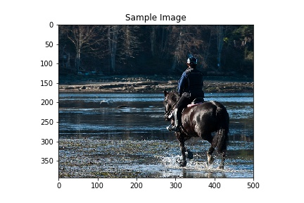
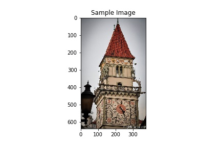
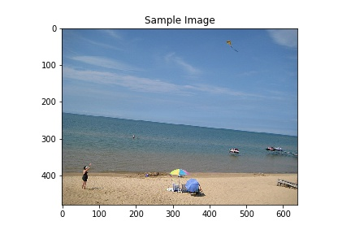
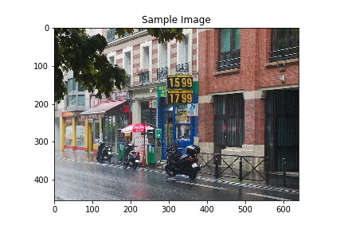

  

   <h1 align="center">Image Captioning</h1>

---

Generating a description of an image is called image captioning. Image captioning requires to recognize the
important objects, their attributes and their relationships in an image. It also needs to generate syntactically
and semantically correct sentences. Deep learning-based techniques are capable of handling the complexities
and challenges of image captioning.

Image captioning is a popular research area of Artificial Intelligence (AI) that deals with image
understanding and a language description for that image. Image understanding needs to detect and
recognize objects. It also needs to understand scene type or location, object properties and their
interactions. Generating well-formed sentences requires both syntactic and semantic understanding
of the language.

  

## Dataset

[MS COCO Dataset](http://cocodataset.org/#home): Microsoft COCO Dataset is a very large dataset for image recognition, segmentation, and captioning. There are various features of MS COCO dataset such as object
segmentation, recognition in context, multiple objects per class, more than 300,000 images, more
than 2 million instances, 80 object categories, and 5 captions per image. Many image captioning
methods use the dataset in their experiments.

  

## Model Architecture

In this project, global
image features are extracted from the hidden activations of CNN and then fed them into an LSTM
to generate a sequence of words.A vanilla CNN is used to obtain the scene type, to detect the objects and their relationships.The output of CNN is used by a language model to convert them into words, combined
phrases that produce an image captions. This project uses a CNN for image representations and an LSTM for generating image captions.

  

## Predictions

  

  <strong>a man riding a horse on a beach near a body of water .</strong>

  

  <strong>a clock tower with a clock on it 's side .</strong>

  

  <strong>a man is flying a kite on the beach</strong>

  

  <strong>a street scene with cars and a bus stop .</strong>

